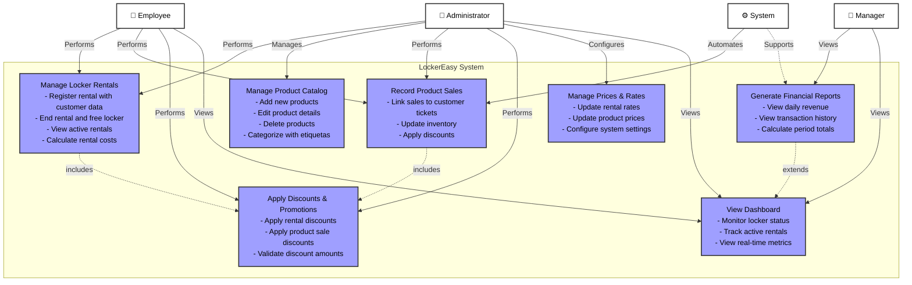

# Use Case Diagram - LockerEasy System

## Diagram

## Implementation Status Legend

- **Solid lines**: Fully implemented relationships
- **Dashed lines**: Includes/extends relationships or partial implementation
- **Red dashed**: Not implemented (e.g., Export to Excel)

## Actors Description

| Actor | Role | Primary Responsibilities |
|-------|------|-------------------------|
| **Employee** | Frontline staff | Register rentals, record sales, apply discounts, view locker status |
| **Administrator** | System manager | All employee functions + manage products, configure prices, manage categories |
| **Manager** | Business oversight | View reports, analyze metrics, export financial data |
| **System** | Automated processes | Auto-update inventory, calculate totals, maintain audit trail |

## Use Cases Summary

| Use Case | Status | Actors Involved |
|----------|--------|----------------|
| Manage Locker Rentals | **IMPLEMENTED** | Employee, Administrator |
| Manage Product Catalog | **IMPLEMENTED** | Administrator |
| Record Product Sales | **IMPLEMENTED** | Employee, Administrator, System |
| Apply Discounts & Promotions | **IMPLEMENTED** | Employee, Administrator |
| Generate Financial Reports | **IMPLEMENTED** | Manager |
| Export to Excel | **NOT IMPLEMENTED** | Manager |
| Manage Prices & Rates | **PARTIAL** (No UI) | Administrator |
| View Dashboard | **PARTIAL** (No metrics) | Employee, Administrator, Manager |

---

## Notes

- All diagrams represent the current system architecture with implemented features
- Dashed elements indicate planned but not yet implemented features
- The system supports offline operation and maintains transaction audit trails
- Missing critical features: Excel export, authentication system, comprehensive dashboard
