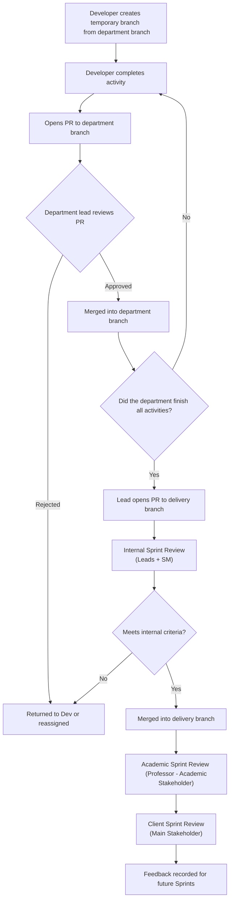
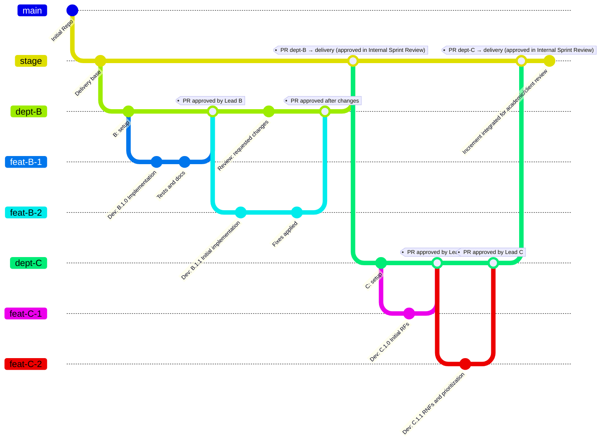

# 📌 Pull Request and Review Flow — LockerEasy

## Working Branches  

- Each **department** has its own working branch.  
- **Developers** create temporary branches based on their department branch to work on specific activities.  

## Pull Request Flow  

1. **Temporary Developer Branch**  
   - The Developer creates a temporary branch cloned from their department branch.  

2. **Pull Request to Department Branch**  
   - When the activity is finished, the Developer opens a PR to the corresponding department branch.  
   - The **department lead** reviews the PR and decides whether to approve it.  
   - ✅ If approved → merged into the department branch.  
   - ❌ If rejected → returned to the Developer or reassigned.  

3. **Pull Request to Delivery Branch**  
   - Once a department completes all planned activities, the **department lead** opens a PR from the department branch into the **delivery branch**.  

4. **Reviews of Delivery PR**  

   - **Internal Sprint Review** (department leads + Scrum Master):  
     - The **only review that approves or rejects the merge into the delivery branch**.  
     - ✅ If approved → PR is merged into the delivery branch.  
     - ❌ If not → missing activities are reassigned to the same Developer or another available one.  

   - **Academic Sprint Review** (professor as academic Stakeholder):  
     - Reviews the Increment already merged into the delivery branch.  
     - Provides feedback on academic compliance (rubric, deadlines).  
     - **Does not authorize or block merges**, only validates results.  

   - **Client Sprint Review** (main Stakeholder):  
     - Evaluates the Increment and provides functional feedback.  
     - **Does not authorize or block merges**, only validates the product from the business perspective.  

## Internal Review Checklist  

- [ ] Acceptance criteria met.  
- [ ] Code tested and free of critical errors.  
- [ ] Minimal documentation included.  
- [ ] Complies with the Definition of Done (DoD).  

## Workflow

---

## Flujo de branchs

