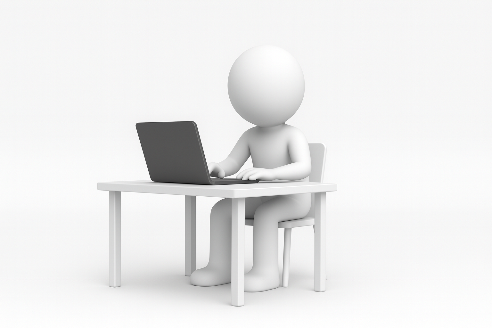
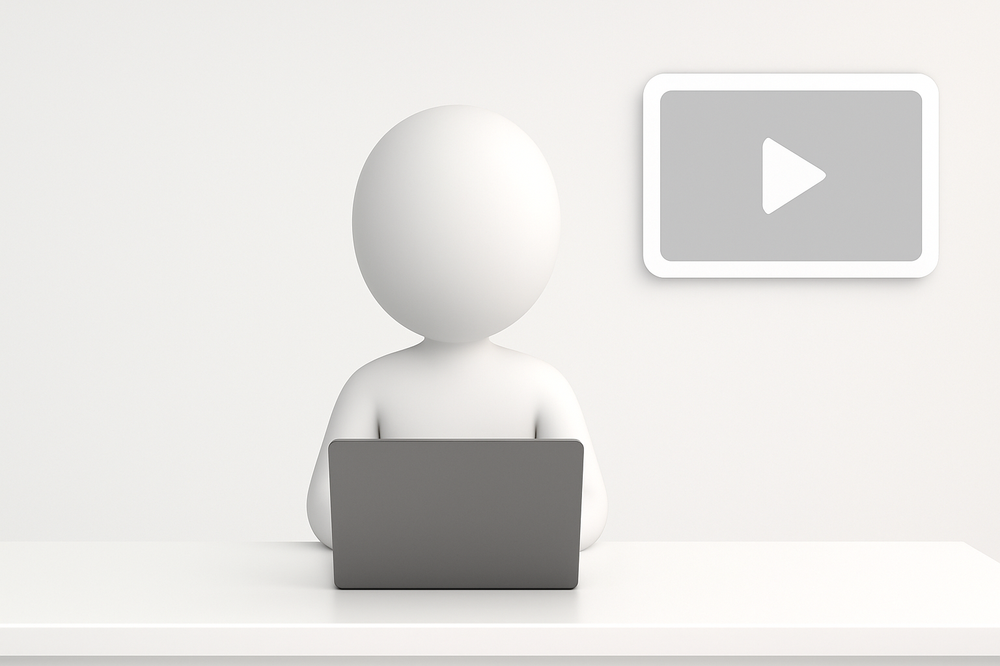
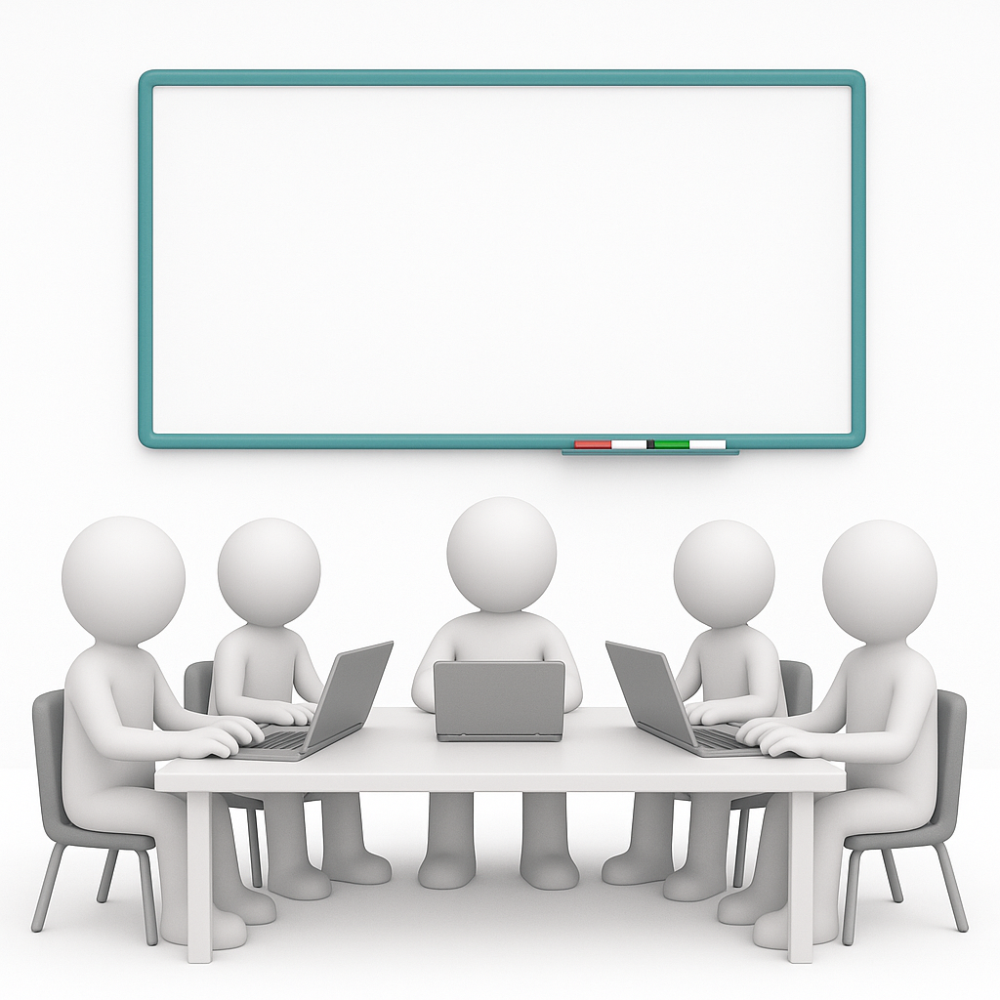
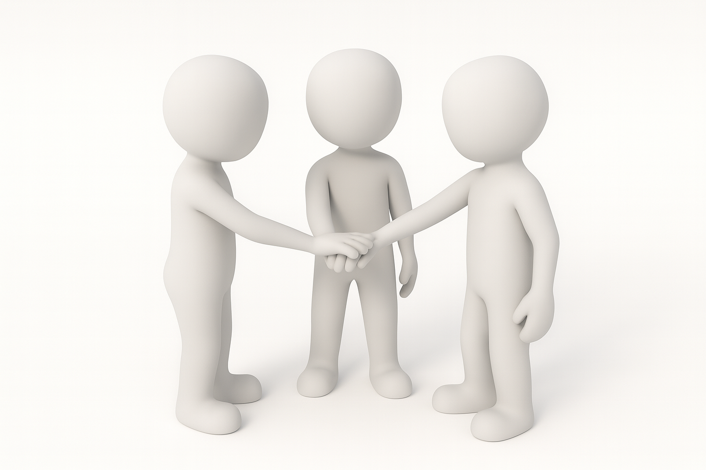
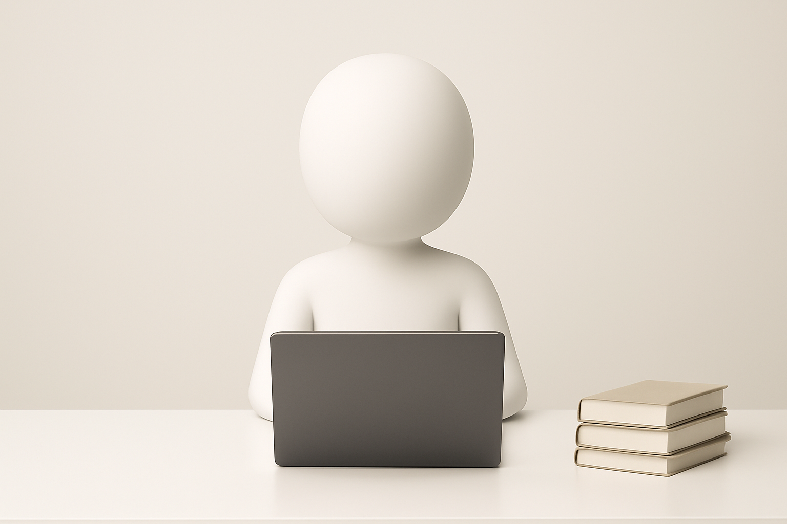

# Storyboards

## Image 1

**Description:** Opening scene: the presenter is seated in front of the laptop, welcoming the audience.

## Image 2

**Description:** The presenter, facing the camera with the laptop on the table, displays supporting graphics while explaining the topic; a small video/image frame appears in the top-right corner to accompany the explanation.

## Image 3

**Description:** The team’s departments are shown along with a few quick sessions (planning/daily/review) using the whiteboard.

## Image 4

**Description:** Collaborative work among the departments and team members is shown.

## Image 5

**Description:** The presenter returns to camera to explain future goals and final conclusions.

## Image 6
Presentation/Assets/StoryBorad7.png)

**Description:** The presenter says goodbye to the audience and gives the final conclusions.
